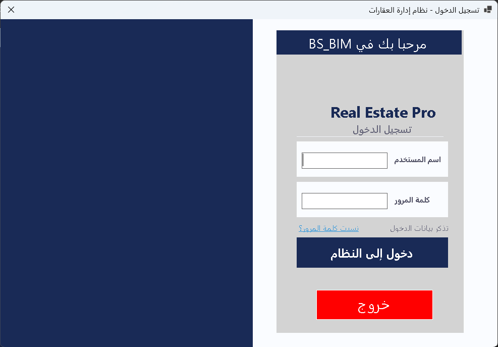
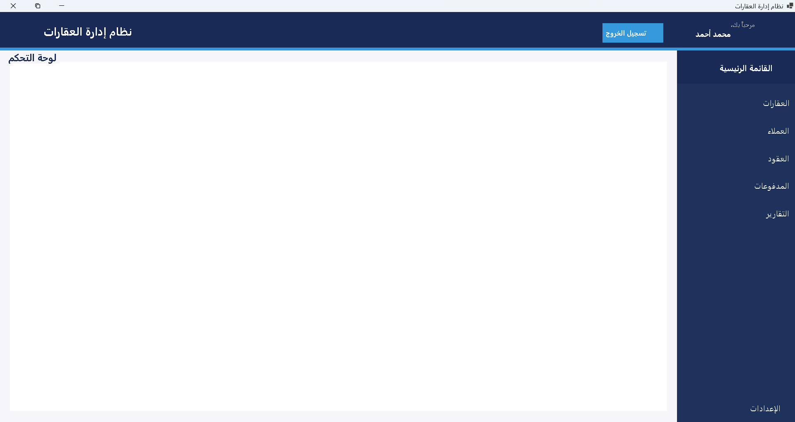
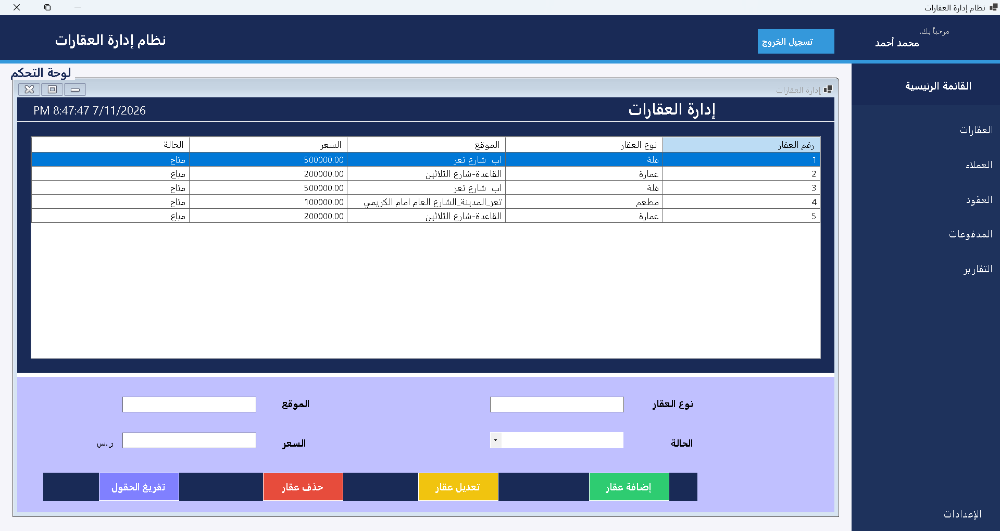
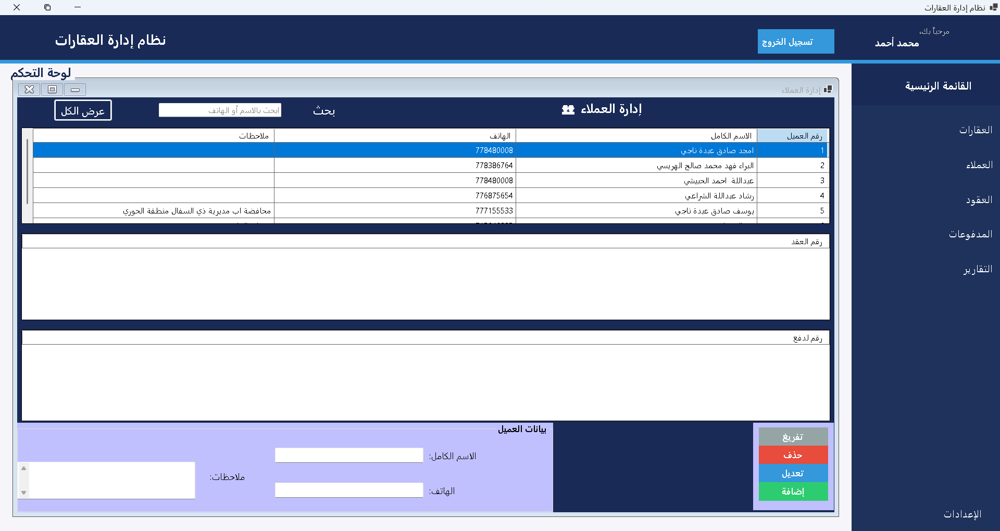
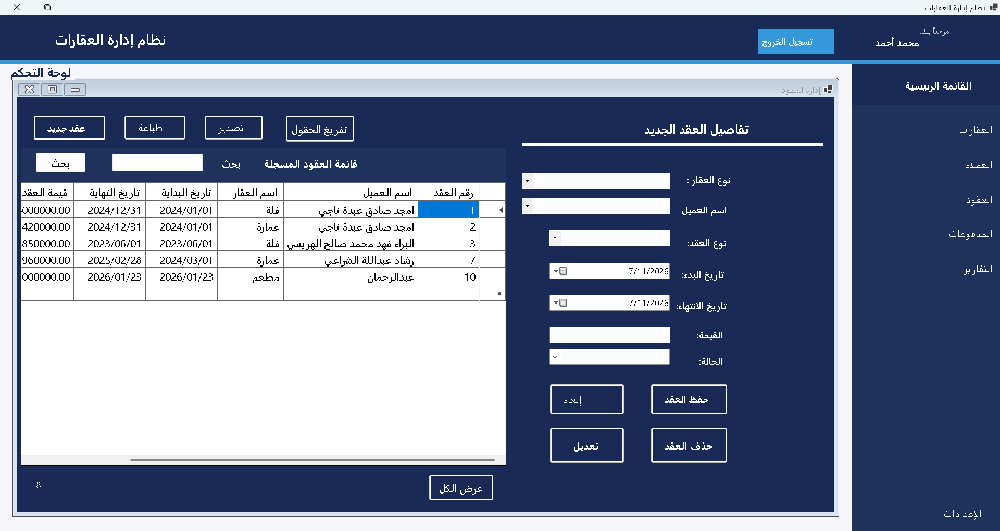
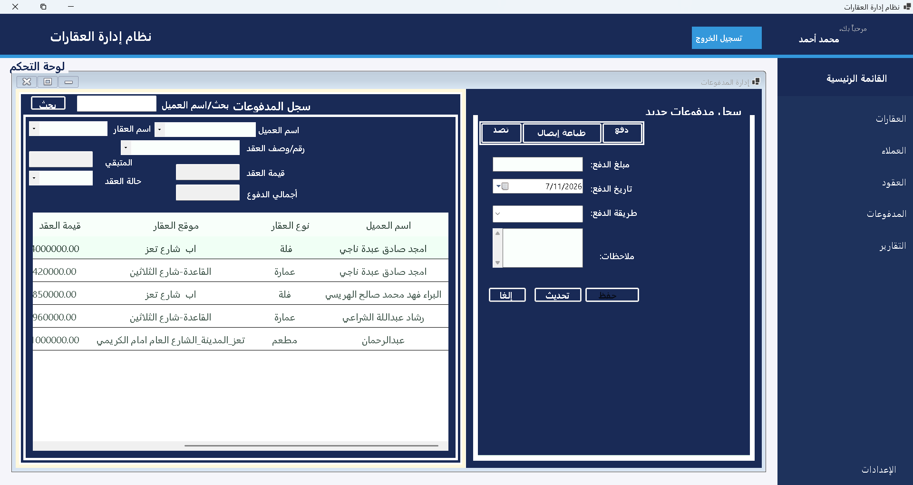
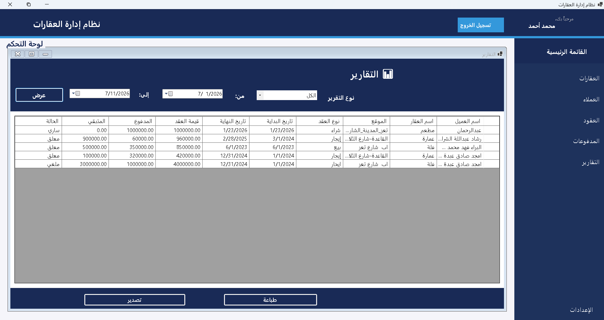
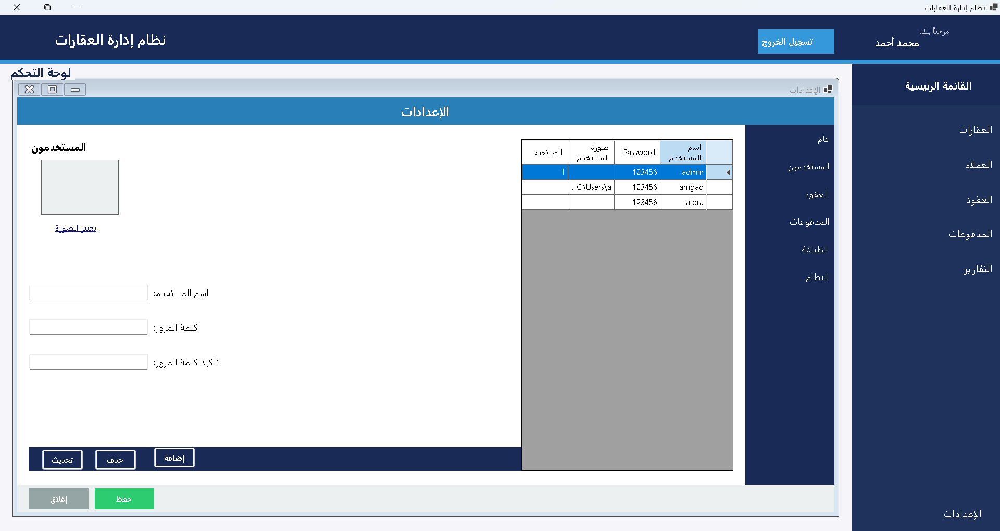

# 🏠 Real Estate Management System


A desktop real estate management application built using **C# WinForms**, **.NET 9**, **SQL Server**, and an **N-Tier Architecture**.

The application provides a complete solution for managing clients, properties, contracts, payments, and reports through a layered architecture that separates the user interface, data access, entities, and helper utilities.

---

# 📸 Application Preview

## 🔐 Login

<p align="center">

</p>

---

## 🏠 Main Dashboard

<p align="center">

</p>

---

## 🏘 Property Management

<p align="center">

</p>

---

## 👥 Customer Management

<p align="center">

</p>

---

## 📄 Contract Management

<p align="center">

</p>

---

## 💰 Payment Management

<p align="center">

</p>

---

## 📊 Reports

<p align="center">

</p>

---

## ⚙ Settings

<p align="center">

</p>

---

# 📑 Table of Contents

- Features
- Screenshots
- Technology Stack
- Architecture
- Database
- Installation
- Project Structure
- Notes
- Future Improvements
- Contact

---

# 🚀 Features

## 🔐 Authentication

The application provides a secure login screen.

Features

- User authentication
- Validate credentials against SQL Server
- Prevent unauthorized access

---

## 👥 Customer Management

Manage all customers stored in the database.

Features

- Display customers
- Add customers
- Edit customers
- Delete customers
- Search customers

Business Rules

- Customers with contracts cannot be deleted.

---

## 🏠 Property Management

Manage real estate properties.

Features

- Display properties
- Add new properties
- Update properties
- Delete properties
- Update property status

Property Status

```text
Available
Rented
Sold
```

---

## 📄 Contract Management

Manage rental and sales contracts.

Features

- Display contracts
- Create contracts
- Update contracts
- Delete contracts
- Search by customer
- View customer contracts

Additional Features

- Automatically update property status
- CSV export
- Printing support

---

## 💰 Payment Management

Manage contract payments.

Features

- Display payments
- Add payments
- Delete payments
- Calculate remaining balance
- View payment summary

Business Rules

- Prevent deleting contracts that contain payments.

---

## 📊 Reports

Generate reports from stored data.

Features

- Contract reports
- Payment reports
- Summary information
- Date filtering

---

## 🖨 Additional Features

The application also includes

- DataGridView row numbering
- CSV export
- Printing support
- Input validation
- Context menu shortcuts

---

# 🛠 Technology Stack

| Category | Technology |
|----------|------------|
| Language | C# |
| Framework | .NET 9 |
| UI | Windows Forms |
| Database | Microsoft SQL Server |
| Data Access | ADO.NET |
| SQL Provider | Microsoft.Data.SqlClient |
| Architecture | N-Tier Architecture |
| Export | CSV |
| Printing | System.Drawing.Printing |
| IDE | Visual Studio |
| Version Control | Git & GitHub |

---

# 🏛 Architecture

The application follows an **N-Tier Architecture** that separates responsibilities into multiple layers.

```text
                 +----------------------+
                 |   Presentation Layer |
                 |    RealEstate.UI     |
                 +----------+-----------+
                            |
                            ▼
                 +----------------------+
                 |  Data Access Layer   |
                 | RealEstate.DataAccess|
                 +----------+-----------+
                            |
                            ▼
                 +----------------------+
                 |    Entity Layer      |
                 | RealEstate.Entities  |
                 +----------+-----------+
                            |
                            ▼
                 +----------------------+
                 |    Helper Layer      |
                 | RealEstate.Helpers   |
                 +----------+-----------+
                            |
                            ▼
                 +----------------------+
                 |      SQL Server      |
                 |    RealEstateDB      |
                 +----------------------+
```

---

## 🖥 Presentation Layer

Project

```text
RealEstate.UI
```

Responsibilities

- Windows Forms interface
- User interaction
- Navigation
- Input validation
- Display application data

Main Forms

```text
FrmLogin
FrmMain
FrmCustomers
FrmManageRealEstate
FrmContracts
FrmPayments
FrmReports
FrmSettings
```

---

## ⚙ Data Access Layer

Project

```text
RealEstate.DataAccess
```

Responsibilities

- SQL Server communication
- CRUD operations
- Execute SQL queries
- Database connection management

Main Classes

```text
ClientDAL
PropertyDAL
ContractDAL
PaymentDAL
ReportsDAL
LoginDAL
Database
```

---

## 📦 Entity Layer

Project

```text
RealEstate.Entities
```

Contains

```text
Client
Property
Contract
Payment
```

---

## 🛠 Helper Layer

Project

```text
RealEstate.Helpers
```

Contains reusable utilities.

```text
DataGridViewPrinter
```

---

# 🗄 Database

The application uses

```text
Microsoft SQL Server
```

Database

```text
RealEstateDB
```

Main Tables

```text
Users
Clients
Properties
Contracts
Payments
```

The database stores:

- User accounts
- Customer information
- Property information
- Contracts
- Payment records

---

# ⚙ Installation

## Requirements

Before running the application, make sure you have:

- Windows
- Visual Studio 2022 (or newer)
- .NET 9 SDK
- Microsoft SQL Server
- SQL Server Management Studio (SSMS)

---

## Setup

### 1. Clone the repository

```bash
git clone https://github.com/Albarafahed/RealEstateSolution-Windwos-Form-C-.git
```

---

### 2. Open the solution

```text
RealEstateSolution.sln
```

---

### 3. Create the database

If the repository includes a SQL script, open it using **SQL Server Management Studio (SSMS)** and execute it.

Example:

```text
Database
└── RealEstateDB.sql
```

This will create the required database and tables.

> If your repository does not include the SQL script, create the database manually before running the project.

---

### 4. Configure the connection string

Open

```text
RealEstate.DataAccess
└── Database.cs
```

Update

```csharp
Database.ConnectionString
```

to match your SQL Server instance.

Example

```text
Data Source=.;
Initial Catalog=RealEstateDB;
Integrated Security=True;
TrustServerCertificate=True;
```

---

### 5. Build and Run

Set

```text
RealEstate.UI
```

as the Startup Project, then press **F5**.

---

# ▶ Running the Project

Application startup flow

```text
Program.cs
      │
      ▼
FrmLogin
      │
      ▼
FrmMain
```

From the main dashboard you can navigate to:

- Customers
- Properties
- Contracts
- Payments
- Reports
- Settings

---

# 📂 Project Structure

```text
RealEstateSolution
│
├── RealEstate.UI
│   ├── FrmLogin
│   ├── FrmMain
│   ├── FrmCustomers
│   ├── FrmManageRealEstate
│   ├── FrmContracts
│   ├── FrmPayments
│   ├── FrmReports
│   └── FrmSettings
│
├── RealEstate.DataAccess
│   ├── ClientDAL
│   ├── PropertyDAL
│   ├── ContractDAL
│   ├── PaymentDAL
│   ├── ReportsDAL
│   ├── LoginDAL
│   └── Database
│
├── RealEstate.Entities
│   ├── Client
│   ├── Property
│   ├── Contract
│   └── Payment
│
├── RealEstate.Helpers
│   └── DataGridViewPrinter
│
├── Images
│   ├── frmLogin.png
│   ├── frmMain.png
│   ├── frmCustomers.png
│   ├── frmMangeRealEstate.png
│   ├── frmContracts.png
│   ├── frmPayments.png
│   ├── frmReports.png
│   └── frmSetings.png
│
└── README.md
```

---

# 📝 Notes

- Desktop Windows Forms application.
- Built using an N-Tier Architecture.
- Uses ADO.NET for SQL Server communication.
- Uses parameterized SQL queries.
- Supports CSV export.
- Supports DataGridView printing.
- Property status is updated automatically when contracts are created.
- Payment summaries are calculated dynamically.

---

# 🔒 Security Notes

Current implementation

- Uses parameterized SQL queries to reduce SQL injection risks.
- Login credentials are validated against the Users table.

Possible improvements

- Store passwords using secure hashing.
- Move the connection string to a configuration file.
- Add centralized exception logging.
- Implement role-based authorization.

---

# ⚠ Known Limitations

Current limitations include

- No automated tests.
- No logging framework.
- No installer package.
- Connection string stored in source code.
- Authentication uses plain-text passwords.
- No database migration scripts.
- No role-based authorization.

---

# 🚀 Future Improvements

### Features

- Advanced property search.
- Dashboard statistics.
- PDF export.
- Excel export.
- Email notifications.
- Property image gallery.

---

### Architecture

- Repository Pattern.
- Dependency Injection.
- Service Layer.
- Better exception handling.

---

### Database

- Database migration scripts.
- Sample data.
- Stored procedures.

---

### Development

- Unit Testing.
- Integration Testing.
- Logging with Serilog.
- Configuration using appsettings.json.

---

# 📷 Images

Application screenshots are located in

```text
Images
│
├── frmLogin.png
├── frmMain.png
├── frmCustomers.png
├── frmMangeRealEstate.png
├── frmContracts.png
├── frmPayments.png
├── frmReports.png
└── frmSetings.png
```

---

# 📚 Learning Objectives

This project demonstrates practical experience with:

- C#
- .NET 9
- Windows Forms
- SQL Server
- ADO.NET
- Object-Oriented Programming (OOP)
- CRUD Operations
- N-Tier Architecture
- Desktop Application Development

---

# 👤 Author

**Albara Fahed Alharissy**

.NET Developer

- GitHub: https://github.com/Albarafahed
- LinkedIn: https://www.linkedin.com/in/albara-csharp-developer/

---

# ⭐ Support

If you found this project useful, consider giving it a **⭐ Star** on GitHub.

---

# 📄 License

This repository does not currently include a LICENSE file.